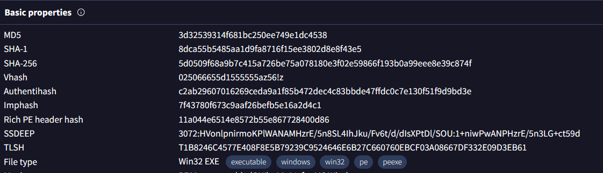
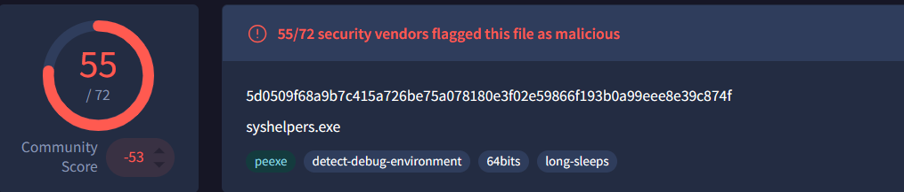
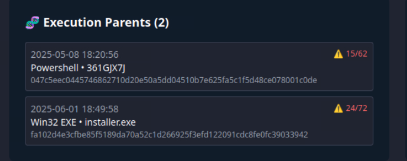
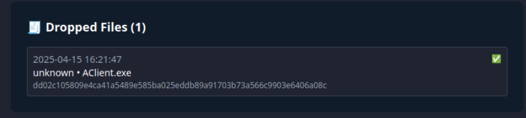
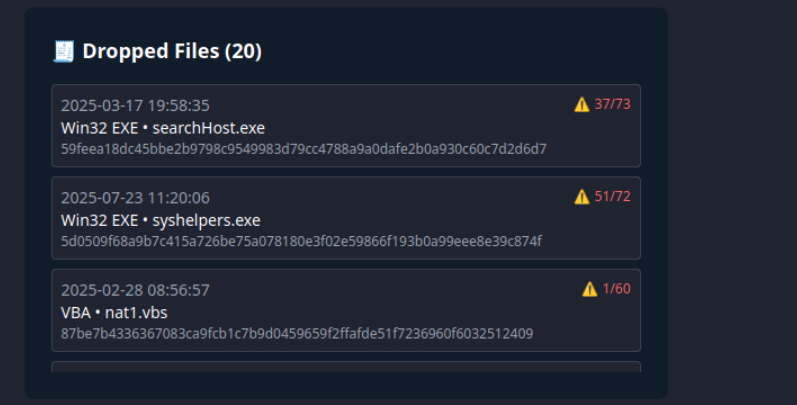
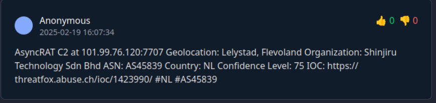
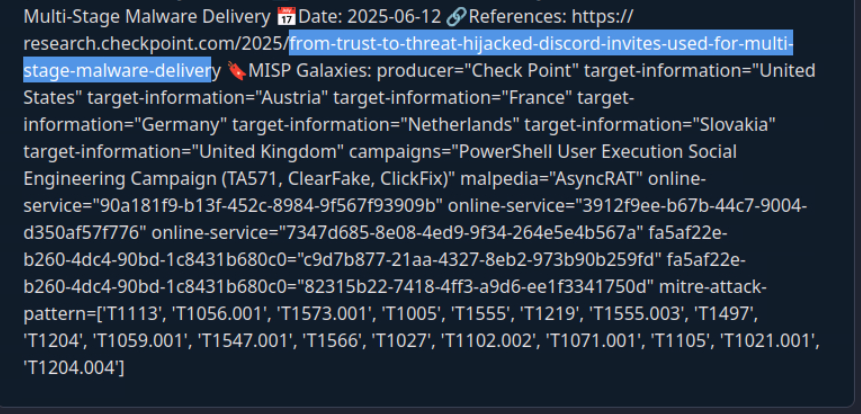
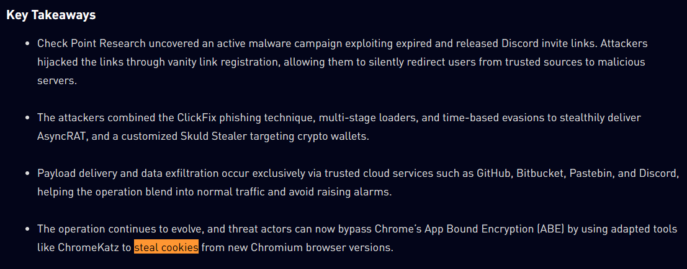
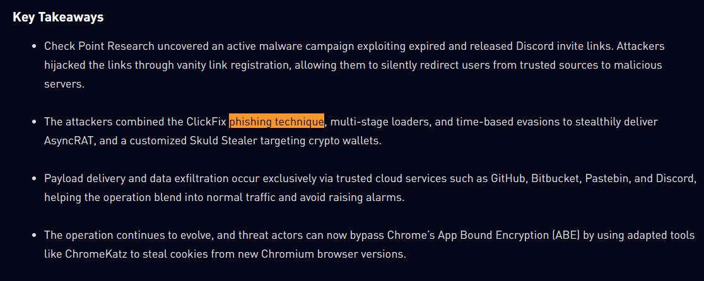
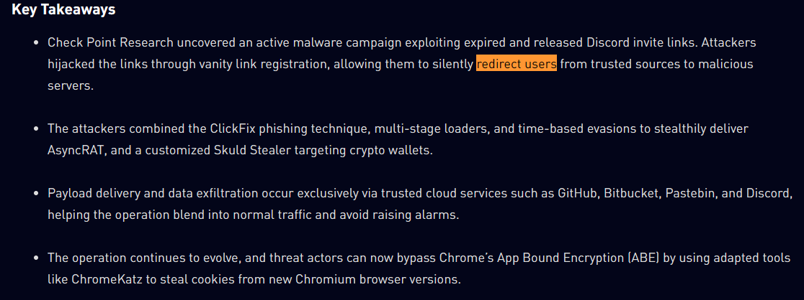

# TryHackMe - Invite Only

**Platform:** TryHackMe  
**Room:** Invite Only  
**Type:** CTF 

---

## Scenario

You are an SOC analyst at **TrySecureMe**, assisting an L3 analyst in investigating suspicious indicators.

Flagged indicators:
- **IP Address:** 101[.]99[.]76[.]120  
- **SHA256 Hash:** 5d0509f68a9b7c415a726be75a078180e3f02e59866f193b0a99eee8e39c874f  

We use **TryDetectThis2.0** to gather threat intelligence.

---

## 1. File Identification

### Question
What is the name of the file identified with the flagged SHA256 hash?

### Answer
syshelpers.exe

---

## 2. File Type

### Question
What is the file type associated with the flagged SHA256 hash?

### Answer
Win32 EXE

---

## 3. Execution Parent Chain

### Question
What are the execution parents of the flagged hash?

### Answer
361GJX7J,installer.exe

> Note: Hashes from this step are reused later.

---

## 4. Dropped File

### Question
What is the name of the file being dropped?

### Answer
Aclient.exe

---

## 5. Malicious Dropped Files

### Question
Research the second hash from question 3. List the four malicious dropped files.

### Answer
searchhost.exe,syshelpers.exe,nat.vbs,runsys.vbs

---

## 6. Malware Family

### Question
What malware family is linked to the flagged IP?

### Answer
asyncrat

---

## 7. Threat Intelligence Report

### Question
What is the title of the original report?

### Answer
From Trust to Threat: Hijacked Discord Invites Used for Multi-Stage Malware Delivery

---

## 8. Cookie Stealer Tool

### Question
Which tool was used to steal Chrome cookies?

### Answer
ChromeKatz

---

## 9. Phishing Technique

### Question
Which phishing technique was used?

### Answer
ClickFix

---

## 10. Redirection Platform

### Question
Which platform was used to redirect users?

### Answer
Discord

---

