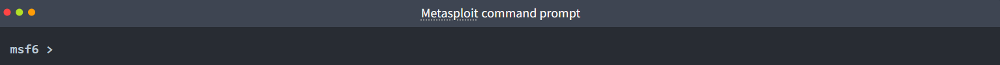
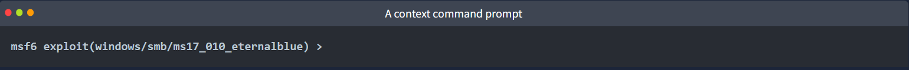
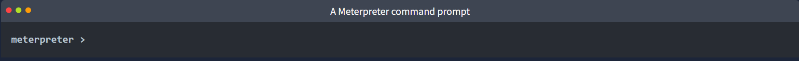
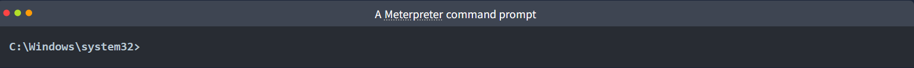

TryHackMe Write-Up
Room: Metasploit - Introduction
========================================================


Platform: TryHackMe  
Category: Exploitation Framework / Pentesting Basics  
Difficulty: Easy
Tool: Metasploit Framework  

--------------------------------------------------------
1. Introduction
--------------------------------------------------------

Metasploit is the most widely used exploitation framework. It is a powerful
tool that can support all phases of a penetration testing engagement, from
information gathering to post-exploitation.

Metasploit has two main versions:

- Metasploit Pro: Commercial version with automation/management features and a GUI
- Metasploit Framework: Open-source, command-line version (focus of this room)

The Metasploit Framework is a set of tools that allow:
- Information gathering
- Scanning
- Exploitation
- Exploit development
- Post-exploitation

Main components of the Metasploit Framework:

- msfconsole: Main command-line interface
- Modules: Exploits, scanners, payloads, etc.
- Tools: Stand-alone tools useful for research / assessment (e.g., msfvenom, pattern_create, pattern_offset)

--------------------------------------------------------
2. Key Concepts (Exploit vs Vulnerability vs Payload)
--------------------------------------------------------

- Exploit: Code that uses a vulnerability present on the target system.
- Vulnerability: A design/coding/logic flaw affecting the target system. Exploitation can disclose data or allow code execution.
- Payload: Code that runs on the target system after exploitation to achieve the attacker's goal (shell, command execution, etc.).

--------------------------------------------------------
3. Metasploit Module Categories
--------------------------------------------------------

### Auxiliary
Supporting modules such as scanners, crawlers, and fuzzers.

### Encoders
Encode exploit/payload content to attempt bypassing signature-based AV.
Note: effectiveness is limited; modern AV can perform additional checks.

### Evasion
Modules designed to actively try to evade antivirus/security solutions (more direct than encoders).

### Exploits
Exploit modules organized by target system/service.

### NOPs
NOPs (No OPeration) do nothing; on Intel x86 they are represented by 0x90.
They are often used as padding/buffer to achieve consistent payload sizes.

### Payloads
Payloads are code that will run on the target system.

Exploits leverage a vulnerability, but to achieve a desired result we need a payload:
- Get a shell
- Run a command
- Load a backdoor
- Launch calc.exe as a benign proof of concept, etc.

A command shell is good, but an interactive connection is better (a “shell”).
Metasploit supports multiple payloads that open shells.

Under payloads, you will see four directories:

- Adapters: Wrap single payloads into different formats (e.g., PowerShell one-liners).
- Singles: Self-contained payloads (add user, launch notepad.exe, etc.) that do not need a second stage.
- Stagers: Set up a connection channel between Metasploit and target (used for staged payloads).
- Stages: Downloaded by the stager; allows larger payloads after initial small stager.

Naming convention for single vs staged payloads:

Single (inline) payload example:
    generic/shell_reverse_tcp

Staged payload example:
    windows/x64/shell/reverse_tcp

Rule:
- “_” often indicates single (inline) payload
- “/” often indicates staged payload components

### Post
Post modules are used after exploitation (post-exploitation): enumeration, privilege escalation, persistence, etc.

--------------------------------------------------------
4. msfconsole Basics
--------------------------------------------------------

Launch Metasploit:
```bash
msfconsole
```

To get more information on a specific command:
```bash
help <command>
```

msfconsole supports tab completion.

Important: msfconsole is context-based. If you change to a different module,
parameters may be lost unless you set them globally.

--------------------------------------------------------
5. Selecting Modules & Viewing Options
--------------------------------------------------------

Selecting a module (auxiliary/payload/exploit/etc.) is done with:
```bash
use <module_name>
```

Inside a module, list required/available settings:
```bash
show options
```

Example: for `exploit/windows/smb/ms17_010_eternalblue` you must set RHOSTS (and usually RPORT).

List compatible payloads while inside a module:
```bash
show payloads
```

Return to the main msfconsole prompt:
```bash
back
```

Get information about a module:
```bash
info
```

Or directly:
```bash
info exploit/windows/smb/ms17_010_eternalblue
```

--------------------------------------------------------
6. Search
--------------------------------------------------------

One of the most useful commands is `search`, which searches the Metasploit database
for modules relevant to your query (CVE, exploit names, service names, etc.).

Example (Apache):
```bash
search Apache
```


--------------------------------------------------------
7. Working With Contexts (Prompts)
--------------------------------------------------------

These are the common prompts you’ll see:

1) Regular terminal prompt (Metasploit commands cannot be used here):


2) msfconsole prompt (no module context set):


3) Module context prompt (context-specific commands available):


4) Meterpreter prompt (Meterpreter agent connected):


5) Shell on the target system (commands run on the target):


--------------------------------------------------------
8. Common Parameters
--------------------------------------------------------

All parameters are set using:
```bash
set PARAMETER_NAME VALUE
```

Common parameters:

- RHOSTS: Target IP address (or CIDR range / network range). Can also use a file:
  `file:/path/to/targets.txt` (one target per line).

- RPORT: Target port where the vulnerable service runs.

- PAYLOAD: Payload used with the exploit.

- LHOST: Attacker (local) IP address (AttackBox / Kali).

- LPORT: Attacker listening port for reverse shell (choose a free port).

- SESSION: Session identifier (used when interacting with existing sessions).

Show current module parameters:
```bash
show options
```

Clear a specific parameter:
```bash
unset <PARAMETER>
```

Clear all parameters in the current module:
```bash
unset all
```

Set a global parameter used across modules:
```bash
setg <PARAMETER> <VALUE>
```

Clear a global parameter:
```bash
unsetg <PARAMETER>
```

Leave exploit context:
```bash
back
```

--------------------------------------------------------
9. Running Exploits & Managing Sessions
--------------------------------------------------------

Run the module:
```bash
exploit
```

Alternative (also works in many modules):
```bash
run
```

Run exploit and background the session:
```bash
exploit -z
```

Some modules support checking if the target is vulnerable:
```bash
check
```

Background the current session (return to msfconsole):
```bash
background
```

Interact with a session:
```bash
sessions -i <session_id>
```

--------------------------------------------------------
11. Exploitation Workflow
--------------------------------------------------------

The exploitation process comprises three main steps:

1) Finding the exploit  
2) Customizing the exploit  
3) Exploiting the vulnerable service  

========================================================
--------------------------------------------------------
   Answers
--------------------------------------------------------
Q: What is the name of the code taking advantage of a flaw on the target system?

A: Exploit

Q: What is the name of the code that runs on the target system to achieve the attacker's goal?

A: Payload

Q: What are self-contained payloads called?
A: Singles

Q: Is "windows/x64/pingback_reverse_tcp" among singles or staged payload?

A: Singles

Q: How would you search for a module related to Apache?

A: search Apache

Q: Who provided the auxiliary/scanner/ssh/ssh_login module?

A: todb

Q: How would you set the LPORT value to 6666?
A:
```bash
set LPORT 6666
```

Q: How would you set the global value for RHOSTS to 10.10.19.23?
A:
```bash
setg RHOSTS 10.10.19.23
```

Q: What command would you use to clear a set payload?
A:
```bash
unset PAYLOAD
```

Q: What command do you use to proceed with the exploitation phase?
A:
```bash
exploit
```
