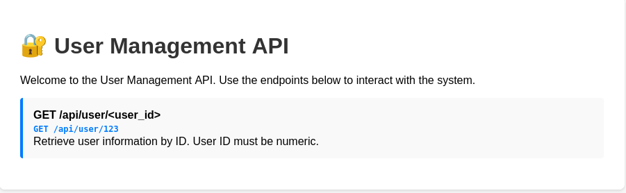
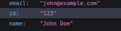
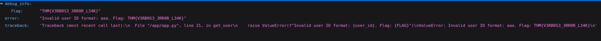
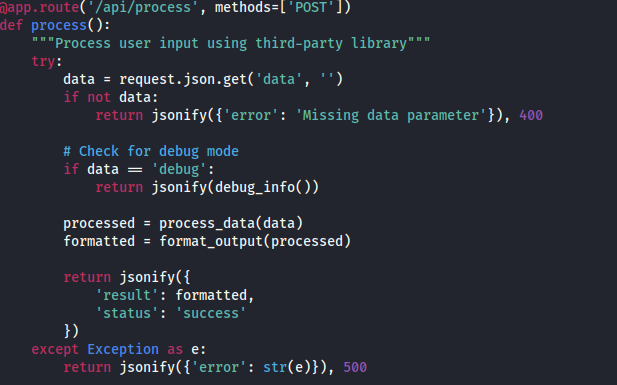
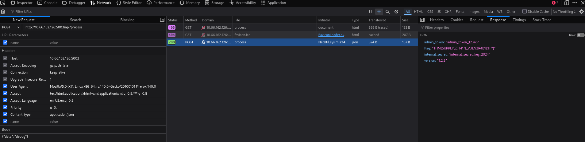

# OWASP Top 10 2025 -- Application Design Flaws

------------------------------------------------------------------------

## AS02: Security Misconfigurations

### What It Is

Security misconfigurations occur when systems, servers, or applications
are deployed with unsafe default settings, incomplete configurations, or
exposed services. These are not code vulnerabilities but mistakes in how
the environment, software, or network is configured. They create easy
entry points for attackers.

### Why It Matters

Even small misconfigurations can expose sensitive data, enable privilege
escalation, or give attackers a foothold in the system.

Modern applications rely on complex stacks, cloud services, and
third-party APIs. A single exposed admin panel, publicly accessible
storage bucket, or misconfigured permission can compromise the entire
system.

### Example

In 2017, Uber exposed a backup AWS S3 bucket containing sensitive user
data because the bucket was publicly accessible. Attackers were able to
download the data without authentication.

### Common Patterns

-   Default credentials left unchanged\
-   Unnecessary services exposed to the internet\
-   Misconfigured cloud storage (S3, Azure Blob, GCP buckets)\
-   Missing authentication or authorization\
-   Verbose error messages exposing stack traces\
-   Outdated software with known vulnerabilities\
-   Exposed AI/ML endpoints without proper access controls

### How To Prevent It

-   Harden default configurations\
-   Enforce strong authentication and least privilege\
-   Limit network exposure\
-   Keep software and containers up to date\
-   Hide stack traces from error messages\
-   Audit cloud configurations regularly\
-   Secure AI endpoints with monitoring\
-   Integrate automated security checks into CI/CD

------------------------------------------------------------------------

### Challenge Walkthrough

We need to find the flag in the **User Management API**.



If we try the `/api/user` endpoint with a numeric ID (as requested by
the developers):



However, if we use an invalid ID such as `aaa`, the application leaks
sensitive information:



**Flag:**\
`THM{V3RB0S3_3RR0R_L34K}`

------------------------------------------------------------------------

## AS03: Software Supply Chain Failures

### What It Is

Software supply chain failures occur when applications rely on
compromised, outdated, or improperly verified third-party components.

### Why It Matters

Modern systems rely heavily on third-party dependencies. A single
compromised library can compromise the entire application.

### Example

The SolarWinds Orion compromise (2021) demonstrated how attackers
injected malicious code into trusted updates, affecting thousands of
organizations.

------------------------------------------------------------------------

### Challenge Walkthrough

This challenge was more difficult than the previous one.

First, we needed to download and analyze the Python script.



The endpoint:

http://10.66.162.126:5003/api/process

Using the browser's developer tools (Network tab), we modified the
request:

-   Changed the method to `GET`
-   Added:

``` json
{
  "data": "debug"
}
```

-   Added header:

Content-Type: application/json

The server response revealed the flag:



**Flag:**\
`THM{SUPPLY_CH41N_VULN3R4B1L1TY}`

------------------------------------------------------------------------

## AS04: Cryptographic Failures

### What It Is

Cryptographic failures occur when encryption is implemented incorrectly
or secrets are hard-coded.

### Challenge Walkthrough

Access:

MACHINE_IP:5004


We find an encoded message.

By inspecting the source code, we discover:

/static/js/decrypt.js

The script contains:

-   AES algorithm\
-   Key\
-   Mode\
-   Base64 encoding

By reproducing the decryption steps in CyberChef, we decode the message.

**Flag:**\
`THM{CRYPTO_FAILURE_H4RDCOD3D_K3Y}`

------------------------------------------------------------------------

## AS05: Insecure Design

### Challenge Walkthrough

The challenge provides a mobile chat app download page:


Initial code inspection did not reveal anything.

Using Gobuster:

gobuster dir -u http://10.66.162.126:5005/api -t 50 -w
/usr/share/dirbuster/wordlists/directory-list-2.3-small.txt

We found:

/api/users


Since it is a chat app, we enumerated additional endpoints:

gobuster dir -u http://10.66.162.126:5005/api/messages -t 50 -w
/usr/share/dirbuster/wordlists/directory-list-2.3-small.txt

We discovered:

/admin

This endpoint exposed the admin access key.

**Flag:**\
`THM{1NS3CUR3_D35IGN_4SSUMPT10N}`

------------------------------------------------------------------------

# Final Flags

-   `THM{V3RB0S3_3RR0R_L34K}`
-   `THM{SUPPLY_CH41N_VULN3R4B1L1TY}`
-   `THM{CRYPTO_FAILURE_H4RDCOD3D_K3Y}`
-   `THM{1NS3CUR3_D35IGN_4SSUMPT10N}`
