# Pickle Rick CTF — Write-up

This **Pickle Rick (TryHackMe)** challenge requires exploiting a vulnerable web server to retrieve **three secret ingredients** that will help Rick create a potion and turn himself back into a human.

The objective of this room is to practice **enumeration**, **web exploitation**, **command execution**, and **privilege escalation**.

---

## Step 1 — Nmap Scan

The first step is to scan the target machine to identify open ports and running services.

### Command used
```bash
nmap -sV -sC target_ip
```

### Results
- **Port 22 (SSH)** — Open  
- **Port 80 (HTTP)** — Open  

This indicates that a web application is running and that SSH access may be possible later if valid credentials are found.


---

## Step 2 — Web Enumeration

We visit the web server in the browser:

```
http://target_ip
```

The page displays a simple Rick and Morty themed website with no obvious functionality.

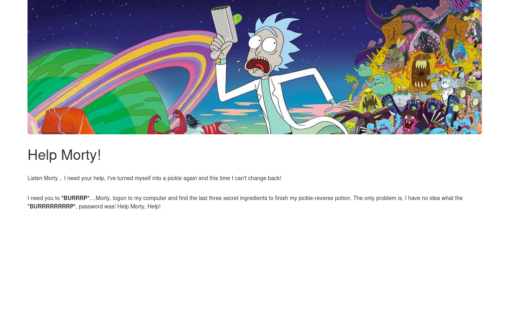

---

## Step 3 — Source Code Inspection

Inspecting the HTML source code reveals an interesting comment:

```html
<!--
Note to self, remember username!
Username: R1ckRul3s
-->
```

This provides a potential username that may be used for authentication later.


---

## Step 4 — robots.txt Enumeration

We check common files and directories such as `/admin`, `/panel`, and `robots.txt`.

The `robots.txt` file exists and contains the following string:

```
Wubbalubbadubdub
```

This looks like a password or a hint, so we keep it for later use.

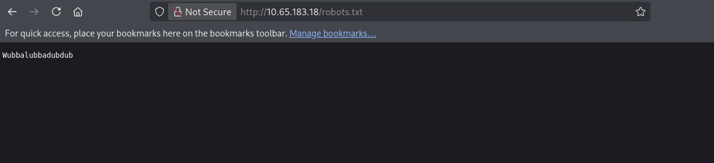

---

## Step 5 — SSH Authentication Attempt

Using the discovered credentials, we attempt to connect via SSH:

- **Username:** `R1ckRul3s`  
- **Password:** `Wubbalubbadubdub`

The SSH login attempt fails, meaning these credentials are likely intended for a web application rather than SSH.

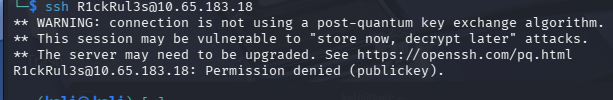

---

## Step 6 — Directory Bruteforcing (Gobuster)

We use Gobuster to enumerate hidden directories and files on the web server.

### Command used
```bash
gobuster dir -u http://target_ip -w wordlist.txt
```

Gobuster reveals a login page:

```
/login.php
```

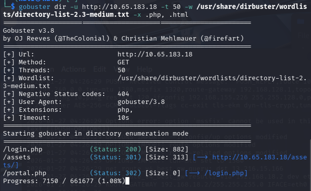

---

## Step 7 — Login Page and Command Panel

Accessing `/login.php`, we try the previously discovered credentials:

- **Username:** `R1ckRul3s`  
- **Password:** `Wubbalubbadubdub`

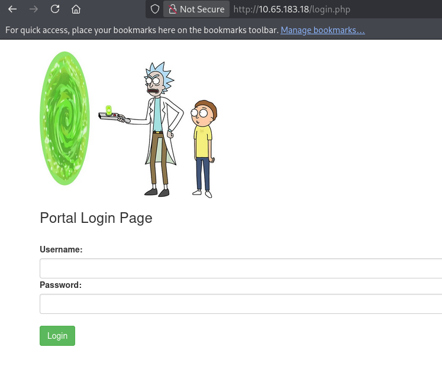

The login is successful, and we gain access to a **command execution panel**, allowing us to run system commands on the server.

This indicates a **command injection / web shell vulnerability**.

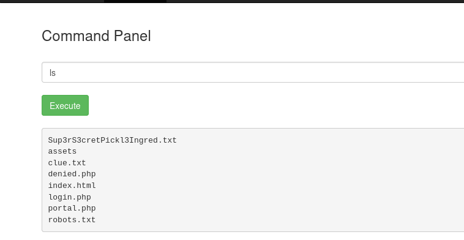

---

## Step 8 — First Ingredient

We attempt to read the file `Sup3rS3cretPickl3Ingred.txt` using commands such as `cat`, but access is restricted.

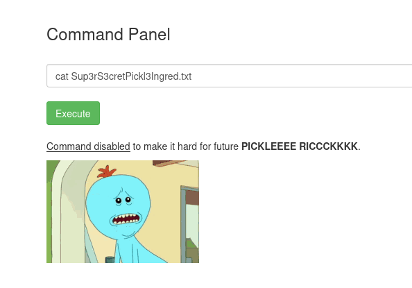

However, accessing the file directly through the browser works:

```
http://target_ip/Sup3rS3cretPickl3Ingred.txt
```

### First ingredient
- **mr. meeseek hair**

---
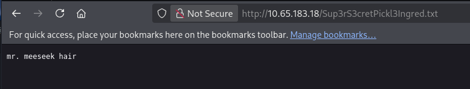
## Step 9 — Clue File and User Enumeration

We read the file `clue.txt`, which suggests that additional ingredients are located in user directories.

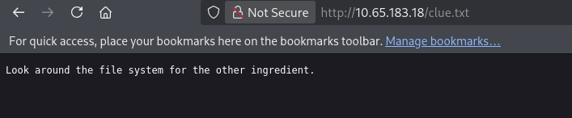

We list the `/home` directory:

```bash
ls /home
```

This reveals a directory named `rick`.

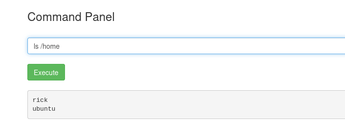

---

## Step 10 — Second Ingredient

Inside `/home/rick`, we find another ingredient file.

The `cat` command does not work, but using `less` bypasses the restriction:

```bash
less second_ingredient.txt
```

### Second ingredient
- **1 jerry tear**

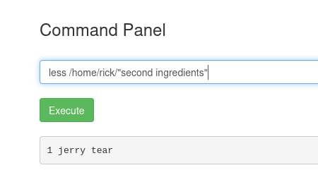

---

## Step 11 — Privilege Escalation and Third Ingredient

We check sudo permissions:

```bash
sudo -l
```

The user is allowed to run commands as **root** without a password.

We list the contents of the `/root` directory:

```bash
ls /root
```
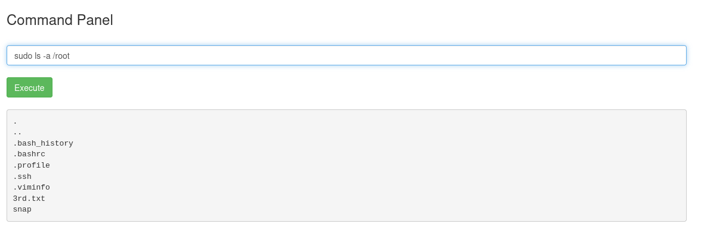
A file named `3rd.txt` is present. Opening it reveals the final ingredient:

```bash
less /root/3rd.txt
```

### Third ingredient
- **fleeb juice**

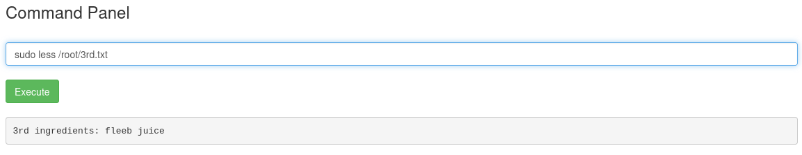

---

## Final Ingredients Summary

- **First ingredient:** mr. meeseek hair  
- **Second ingredient:** 1 jerry tear  
- **Third ingredient:** fleeb juice  

---

## Conclusion

This challenge highlights the impact of poor web security practices. Exposed comments, weak authentication mechanisms, and unsafe command execution can quickly lead to full system compromise.
