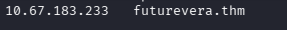
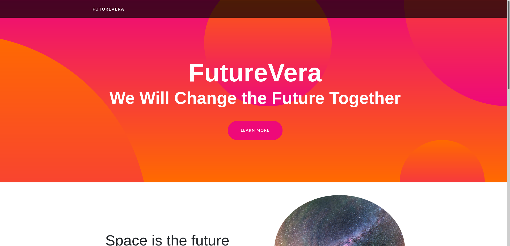
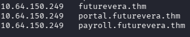
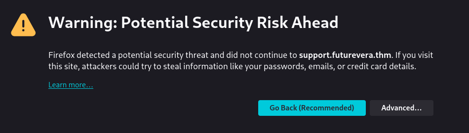
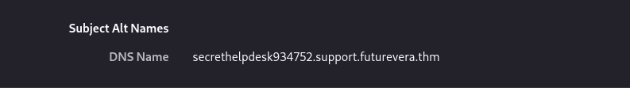
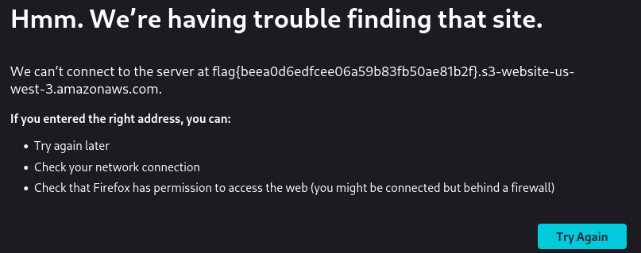

# TakeOver


This challenge revolves around subdomain enumeration.

**Difficulty:** Easy\
**Link:** https://tryhackme.com/room/takeover

------------------------------------------------------------------------

## Description

I am the CEO and one of the co-founders of futurevera.thm. At
Futurevera, we believe that the future lies in space. We conduct
extensive space research and write blogs about it. We used to assist
students with space-related questions, but we are currently rebuilding
our support system.

Recently, blackhat hackers approached us claiming they could take over
our subdomains and are asking for a large ransom. Please help us
identify which subdomains are vulnerable to takeover.

------------------------------------------------------------------------

## Step-by-Step Approach

### 1. Adding MACHINE_IP to /etc/hosts

First, we add the machine's IP address to our /etc/hosts file for local
domain resolution.

``` bash
sudo nano /etc/hosts
```

Afterward, we add the IP address and domain.



------------------------------------------------------------------------

### 2. Access the Main Site

We visit:

    https://futurevera.thm/



------------------------------------------------------------------------

### 3. Enumerate Subdomains Using Gobuster

We use Gobuster for subdomain enumeration:

``` bash
gobuster vhost -t 50 -u futurevera.thm -w /usr/share/wordlists/subdomains-top1million-110000.txt --append-domain
```


------------------------------------------------------------------------

### 4. Add the Found Subdomains to /etc/hosts

After running Gobuster, we discovered several subdomains. We add them to
/etc/hosts to ensure proper resolution.

Two subdomains are only accessible via VPN:

-   payroll.futurevera.thm
-   portal.futurevera.thm



------------------------------------------------------------------------

### 5. Check the Support Page

According to the CEO's message, they are rebuilding the support system. So, we focus on the support subdomain. After adding it to /etc/hosts, we encounter a warning page, suggesting something is not correctly configured.



------------------------------------------------------------------------

### 6. Check the SSL/TLS Certificate

We discover a new subdomain:

    secrethelpdesk934752.support.futurevera.thm



------------------------------------------------------------------------

### 7. Access the Discovered Subdomain

HTTPS (Port 443): SSL/TLS error.



This subdomain is misconfigured and vulnerable, it's pointing to an S3
bucket that doesn't exist. If the bucket doesn't exist or has been
deleted, an attacker can take control of this subdomain.

This confirms a subdomain takeover vulnerability.
The flag is revealed in the URL.


------------------------------------------------------------------------

##  Flag

    flag{beea0d6edfcee06a59b83fb50ae81b2f}

------------------------------------------------------------------------

## Conclusion

This challenge emphasized understanding and exploiting subdomain
takeover vulnerabilities and how attackers can abuse abandoned cloud
resources like S3 buckets.
